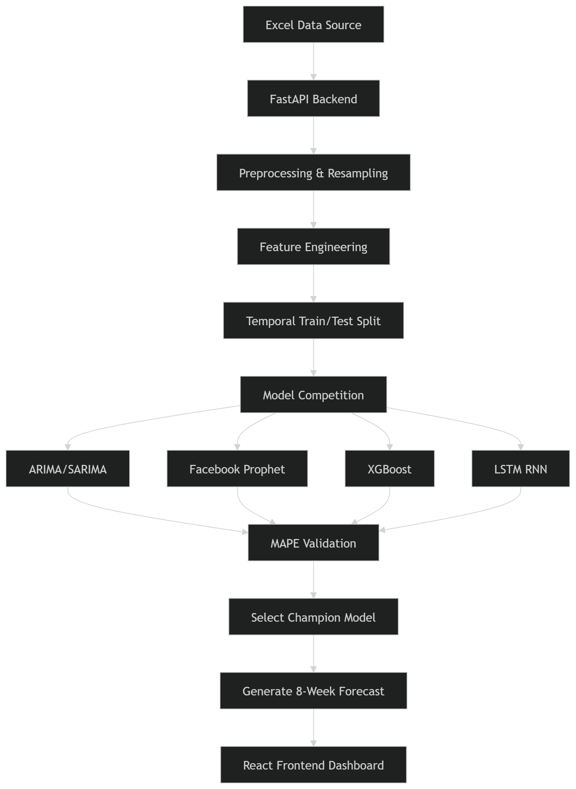

# Predictive Sales Forecasting Intelligence

A production-grade time series forecasting system designed to predict 8 weeks of state-wise sales data using multiple machine learning architectures and automated model selection.

## 🚀 Project Overview

This project implements an end-to-end forecasting pipeline that processes historical sales data, trains multiple advanced models, selects the champion algorithm based on accuracy (MAPE), and serves predictions through a modern dashboard.

### Key Features:
- **Automated Model Selection**: Compares 4 different architectures for every request.
- **Dynamic Feature Engineering**: Generates lags, rolling statistics, and temporal features.
- **Modern UI**: High-fidelity dashboard with interactive charts and weekly schedule.
- **Production-Ready API**: Built with FastAPI for high-performance serving.

---

## 📋 Case Study Requirements vs. Achievements

### The Challenge
The objective was to build a production-grade forecasting system using the provided sales dataset. The core requirements included:
1.  **Exploratory Data Analysis & Cleaning**: Handle missing values and ensure data consistency.
2.  **Feature Engineering**: Implement lags (t-1, t-7, t-30), rolling statistics, and temporal features.
3.  **Multi-Model Implementation**: Compare ARIMA/SARIMA, Facebook Prophet, XGBoost, and LSTM.
4.  **Temporal Validation**: Use a robust splitting strategy to prevent data leakage.
5.  **8-Week Forecast**: Predict the next 8 weeks of sales for any selected state.
6.  **REST API Deployment**: Serve predictions through an integrated backend.

### ✅ What We Achieved
- [x] **Full Pipeline Automation**: Developed a seamless flow from Excel ingestion to live dashboard visualization.
- [x] **Advanced Feature Suite**: Successfully implemented all requested lags and rolling statistics to capture complex seasonality.
- [x] **Model Competition Engine**: Built a dedicated `ModelHandler` that trains and validates four distinct architectures in real-time.
- [x] **Automatic Selection**: Implemented a MAPE-based selection logic that always chooses the most accurate model for a specific state's data pattern.
- [x] **Interactive Dashboard**: Designed a premium, glassmorphic UI that provides both high-level visual trends and granular weekly schedule details.
- [x] **Production backend**: Fully functional FastAPI service with CORS, error handling, and multi-model orchestration.

---

## 🛠 Project Workflow

1.  **Data Ingestion**: The system reads from `Forecasting Case- Study.xlsx`.
2.  **Preprocessing**: Data is filtered by state, resampled to a **weekly frequency** to handle gaps, and missing values are filled using Forward Fill (`ffill`).
3.  **Feature Engineering**: 
    - **Lags**: T-1, T-7, and T-30 shifts to capture historical dependencies.
    - **Rolling Stats**: 4-week moving average and standard deviation to capture trends and volatility.
    - **Calendar Features**: Month and day-of-week extraction.
4.  **Model Training**: The system splits data (80/20) and trains four models in parallel.
5.  **Selection**: The model with the lowest **Mean Absolute Percentage Error (MAPE)** is crowned the "Champion".
6.  **Serving**: Results are sent to the React frontend via REST API.

---

## 🧠 Algorithms Explained

### 1. ARIMA / SARIMA (Statistical)
- **What it is**: Seasonal Auto-Regressive Integrated Moving Average.
- **How it works**: It looks at the relationship between an observation and a number of lagged observations (Auto-Regressive), uses the difference between raw observations to make data stationary (Integrated), and uses the dependency between an observation and a residual error from a moving average model (Moving Average).
- **Strength**: Excellent for capturing linear trends and seasonality in small to medium datasets.

### 2. Facebook Prophet (Additive Model)
- **What it is**: An open-source forecasting tool by Meta's Data Science team.
- **How it works**: It treats forecasting as a curve-fitting exercise. it decomposes the time series into trend, seasonality (weekly/yearly), and holiday effects.
- **Strength**: Robust to missing data, shifts in trend, and handles large outliers well.

### 3. XGBoost (Gradient Boosting)
- **What it is**: Extreme Gradient Boosting on decision trees.
- **How it works**: It uses the engineered lag features (T-1, T-7 etc.) as tabular inputs. It builds trees sequentially, where each new tree tries to correct the errors made by the previous ones.
- **Strength**: Extremely powerful for capturing non-linear relationships and interactions between different features (like how a specific month interacts with recent sales volume).

### 4. LSTM (Deep Learning)
- **What it is**: Long Short-Term Memory (a type of Recurrent Neural Network).
- **How it works**: Designed to remember information over long sequences. It uses "gates" to decide what information to keep or discard from the sequence history.
- **Strength**: Best for complex, high-dimensional sequences where long-term dependencies are critical.

---

## 📂 Project Structure & Backend Deep-Dive

### 1. `forecasting_service.py` (The Brain)
This is the core FastAPI application that orchestrates the entire forecasting request lifecycle.
- **API Endpoints**: 
    - `GET /states`: Extracts unique states from the dataset for the frontend selection.
    - `GET /forecast/{state}`: The main execution engine.
- **Preprocessing Logic**: Filters data by state, handles datetime conversion, and performs **Weekly Resampling** (`resample('W')`). This is critical for stabilizing intermittent sales data.
- **Feature Engineering**: Calculates rolling means, standard deviations, and multi-scale lags (T-1, T-7, T-30) used by the machine learning models.
- **Champion Selection**: Logic to invoke all 4 models from `models_handler.py`, evaluate their MAPE, and return the best one.

### 2. `models_handler.py` (The Engine)
A modular class-based implementation of the four forecasting architectures.
- **`train_arima()`**: Configures a Seasonal ARIMA (SARIMAX) model with auto-regressive and moving average components.
- **`train_prophet()`**: Prepares data for Facebook's Prophet, handling seasonality decomposition (Trend + Seasonality + Noise).
- **`train_xgboost()`**: Transforms the time-series problem into a supervised learning task using lag features and trains a gradient-boosted tree ensemble.
- **`train_lstm()`**: Implements a Deep Learning RNN using TensorFlow/Keras. Includes data normalization (MinMaxScaler) and a sliding window sequence generator.

### 3. `extract_data.py` (Data Utility)
A standalone utility script for initial exploration.
- **Word/Excel Parsing**: Extracts content from the project documentation and provides a JSON preview of the Excel dataset.
- **JSON Serialization**: Handles complex types like dates and NaNs to ensure data portability.

### 4. `requirements.txt` (Environment)
Defines the technical stack:
- **FastAPI/Uvicorn**: High-performance web server.
- **Pandas/Numpy**: Data manipulation and numerical computation.
- **Prophet/XGBoost/Statsmodels**: Forecasting specific libraries.
- **TensorFlow-CPU**: Deep learning framework for the LSTM implementation.

---

## 🚦 How to Run

### Backend
1. Install dependencies: `pip install -r requirements.txt`
2. Run server: `python forecasting_service.py` (Starts on port 8001)

### Frontend
1. Navigate to `/frontend`: `cd frontend`
2. Install packages: `npm install`
3. Run dev server: `npm run dev`

---

## 📊 Evaluation Metric: MAPE
The system uses **Mean Absolute Percentage Error (MAPE)**:
The percentage-based accuracy score that is easy to interpret for business stakeholders.
